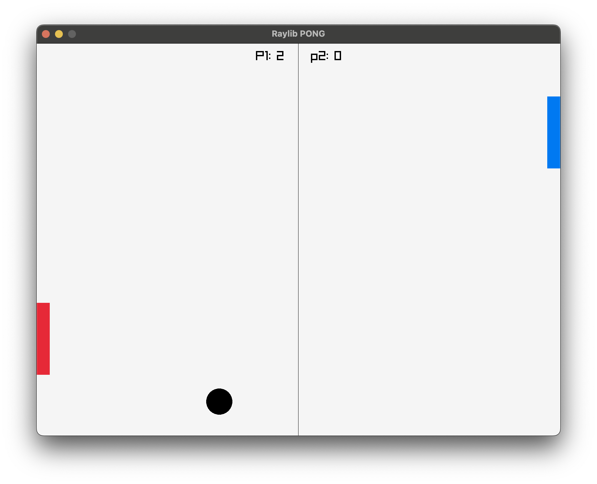

# PONG

This is the game Pong written using Raylib in C++. I had [prevously made the game in C](https://github.com/GarbhanK/raylib-pong) as a way of learning Raylib so it's nice to refactor this with everything I've learned from [sticky-paws](https://github.com/GarbhanK/sticky-paws).

